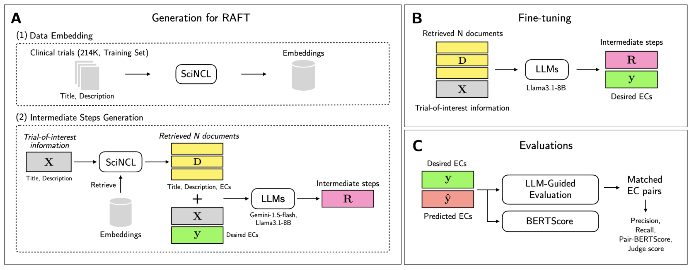
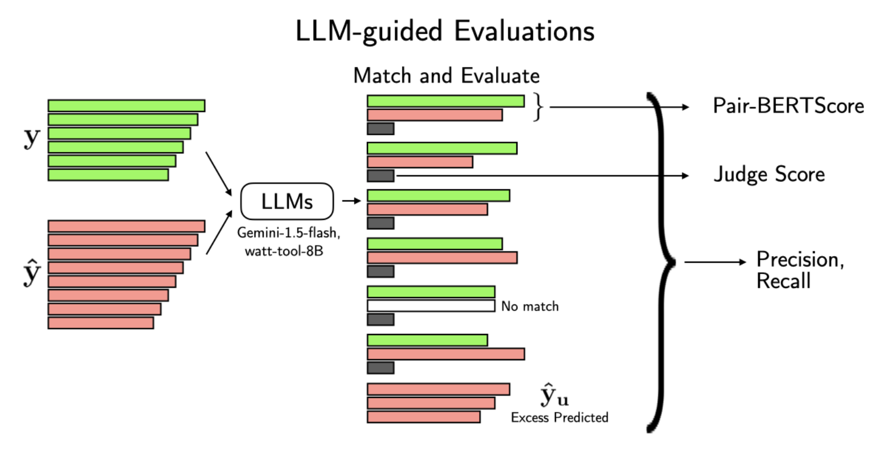

<div align="center">
  
</div>

<div align="center">
    <a href="https://colab.research.google.com/github/biodatlab/ec-raft/blob/main/EC_RAFT_gradio.ipynb">
        
    </a>
</div>

## EC-RAFT: Automated Generation of Clinical Trial Eligibility Criteria through Retrieval-Augmented Fine-Tuning

This repository contains the implementation of [EC-RAFT (ACL 2025 findings)](https://aclanthology.org/2025.findings-acl.491/), a method that utilizes Retrieval-Augmented Fine-Tuning (RAFT) to generate structured and cohesive **eligibility criteria** directly from clinical trial titles and descriptions.

## Installation

Start by cloning the repository and installing the required dependencies:

```bash
git clone https://github.com/biodatlab/ec-raft
cd ec-raft
pip install -r requirements.txt
pip install xtuner
```

## Predict ECs with EC-RAFT

Quick Start with Minimal Inference Script using vLLM
**Note**: First run `python embed.py` if you haven't already to create the required embeddings.

```python
import chromadb
from sentence_transformers import SentenceTransformer
from vllm import LLM, SamplingParams
from client import Client
from prompt_gen.inference_prompt_generator import InferencePromptGenerator

title = input("Enter clinical trial title: ")
description = input("Enter clinical trial description: ")

# Initialize components
chroma_client = chromadb.PersistentClient(path="./clinical_trials_chroma_all")
collection = chroma_client.get_collection("clinical_trials_studies")
embed_model = SentenceTransformer("malteos/scincl")
llm = LLM(model="biodatlab/ec-raft", tensor_parallel_size=1, max_model_len=25000)

# Setup EC_RAFT client and generator
client = Client(chroma_client, embed_model, collection)
inference_generator = InferencePromptGenerator(client)

# Generate and process response
messages = inference_generator.generate_inference_messages(title, description, "user_input", 4)
formatted_prompt = llm.get_tokenizer().apply_chat_template(messages, add_generation_prompt=True, tokenize=False)
outputs = llm.generate([formatted_prompt], SamplingParams(max_tokens=4096, min_p=0.03, temperature=0.3))
response = outputs[0].outputs[0].text
```

## Interactive Demo with Gradio

For an interactive experience, we provide a Gradio-based web interface. The easiest way to get started is to use the "Open in Colab" badge at the top of this file.
This will start a local web server where you can interact with the EC-RAFT model.

## Training EC-RAFT

The EC-RAFT method follows a systematic preprocessing pipeline. The embedding creation step processes clinical trials from the dataset and uses the [SciNCL](https://arxiv.org/abs/2202.06671) to create semantic embeddings, which are then stored in ChromaDB for fast retrieval. During data generation, the system retrieves similar trials for each target trial and uses large language models to generate intermediate reasoning steps, creating comprehensive training datasets.

<div align="center">
  
</div>

### Step 1: Create Data Embeddings

Generate embeddings for the clinical trials dataset using the SciNCL model:

```bash
python embed.py
```

This script loads the prepared [clinical trials dataset](https://huggingface.co/datasets/biodatlab/ec-raft-dataset) from HuggingFace, creates embeddings, and stores them in ChromaDB for efficient retrieval during training.

### Step 2: Preprocess Training Data

Generate training data with intermediate reasoning steps by retrieving similar trials:

```bash
python preprocess.py --experiment_name "my_experiment" --top_n 4 --split train
```

The `--top_n` parameter controls how many similar trials to retrieve (1-5), while `--experiment_name` sets your experiment identifier. You can process different dataset splits using the `--split` parameter (train/validation/test).

### Step 3: Configure and Run Fine-tuning

Edit the [XTuner](https://github.com/InternLM/xtuner) configuration file to set your model and data paths.

```bash
# Model settings
pretrained_model_name_or_path = '<PATH_TO_MODEL>'  # e.g., "meta-llama/Llama-3.1-8B-Instruct"
cache_dir = "<PATH_TO_CACHE>"

# Data settings
ecraft_en_path = '<PATH_TO_DATA>'  # Path to your processed training data 
```

The fine-tuning process leverages XTuner with LoRA (Low-Rank Adaptation) for efficient training.
Ensure your training data is in the correct format. **GPU Requirements**: 4x NVIDIA A100 GPUs.
Then start training:

```bash
# Run fine-tuning
xtuner train config/ec-raft-xtuner.py
```

## Run EC-RAFT on test dataset

To run the complete EC-RAFT pipeline on the test dataset:

```bash
# Step 1: Create embeddings
python embed.py

# Step 2: Preprocess test data with retrieval
python preprocess.py --experiment_name "my_experiment" --top_n 4 --split test

# Step 3: Generate predictions
python inference.py --input_file "path/to/generated/parquet/by/step/2"
```

The inference script will use your trained EC-RAFT model to generate eligibility criteria for the test trials

## 📈 Evaluation

The evaluation process includes free-text assessment using Gemini for clinical relevance, structured parsing to convert evaluations into JSON format, and metric calculation covering BERTScore, precision, recall, and judge scores.

<div align="center">
  
</div>

**BERTScore** measures semantic similarity between generated and reference criteria, while **LLM-guided evaluation** uses a judge model to assess clinical relevance. Traditional **precision** and **recall** metrics provide quantitative agreement measurements. To run a complete evaluation:

```bash
python evaluate.py \
    --experiment_name "my_experiment" \
    --reference_column "desired_criteria" \
    --predicted_column "response"
```

## BibTeX Citation

If you use [EC-RAFT](https://aclanthology.org/2025.findings-acl.491/) in your research, cite our paper using the following BibTex

```
@inproceedings{lekuthai-etal-2025-ec,
    title = "{EC}-{RAFT}: Automated Generation of Clinical Trial Eligibility Criteria through Retrieval-Augmented Fine-Tuning",
    author = "Lekuthai, Nopporn  and
      Pewngam, Nattawit  and
      Sokrai, Supitcha  and
      Achakulvisut, Titipat",
    editor = "Che, Wanxiang  and
      Nabende, Joyce  and
      Shutova, Ekaterina  and
      Pilehvar, Mohammad Taher",
    booktitle = "Findings of the Association for Computational Linguistics: ACL 2025",
    month = jul,
    year = "2025",
    address = "Vienna, Austria",
    publisher = "Association for Computational Linguistics",
    url = "https://aclanthology.org/2025.findings-acl.491/",
    pages = "9432--9444",
    ISBN = "979-8-89176-256-5",
    abstract = "Eligibility criteria (EC) are critical components of clinical trial design, defining the parameters for participant inclusion and exclusion. However, designing EC remains a complex, expertise-intensive process. Traditional approaches to EC generation may fail to produce comprehensive, contextually appropriate criteria. To address these challenges, we introduce EC-RAFT, a method that utilizes Retrieval-Augmented Fine-Tuning (RAFT) to generate structured and cohesive EC directly from clinical trial titles and descriptions. EC-RAFT integrates contextual retrieval, synthesized intermediate reasoning, and fine-tuned language models to produce comprehensive EC sets. To enhance clinical alignment evaluation with referenced criteria, we also propose an LLM-guided evaluation pipeline. Our results demonstrate that our solution, which uses Llama-3.1-8B-Instruct as a base model, achieves a BERTScore of 86.23 and an EC-matched LLM-as-a-Judge score of 1.66 out of 3, outperforming zero-shot Llama-3.1 and Gemini-1.5 by 0.41 and 0.11 points, respectively. On top of that, EC-RAFT also outperforms other fine-tuned versions of Llama-3.1. EC-RAFT was trained in a low-cost setup and, therefore, can be used as a practical solution for EC generation while ensuring quality and relevance in clinical trial design. We release our code on GitHub at https://github.com/biodatlab/ec-raft/"
}
```